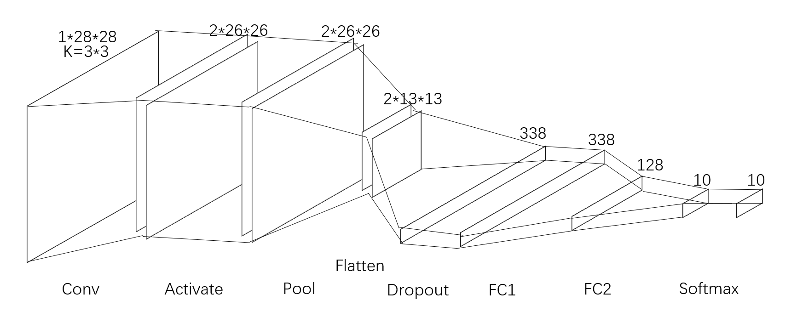
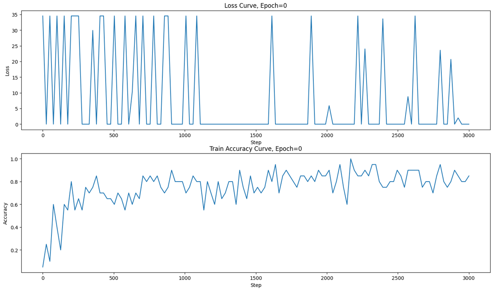
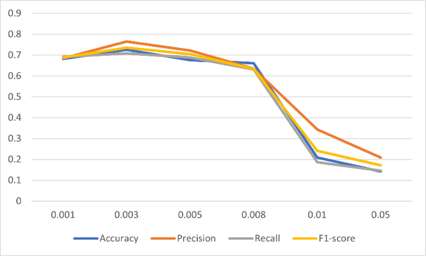
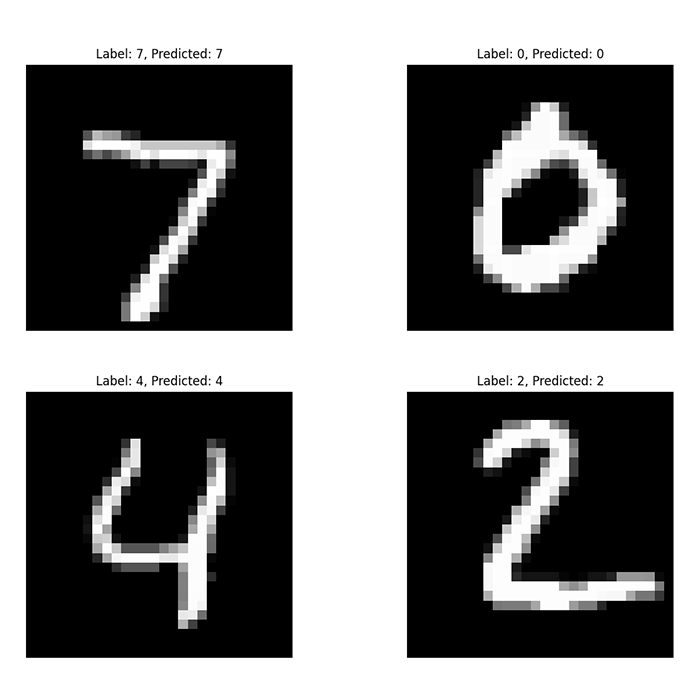

# MnistCNN
An implementation of convolution nueral network for recognizing hand-written digits **without** depending on torch or tensorflow, etc.  
## Structure

## How to use
Run `main.py` and wait for training process. Then, it will show the loss curve, accuracy curve, and some performance index. After closing the plot, you can enter an image index in the terminal to supervise the  recognizing result directly.  
(It uses MNIST built-in keras, but you can modify it easily.)
## Curves

Fig.1 Loss curve and accuracy curve.

Fig.2 Learning rate curve
## Result

Fig.3 Preview
## Notice
There is something wrong with weight updation in the process of convolution layer backward propagation. To prevent this problem, we use 2 Sobel filters and cancelled weight updation in the convolution layer.
The result is acceptable as well. You can fix bugs inside ConvLayer on yourself.